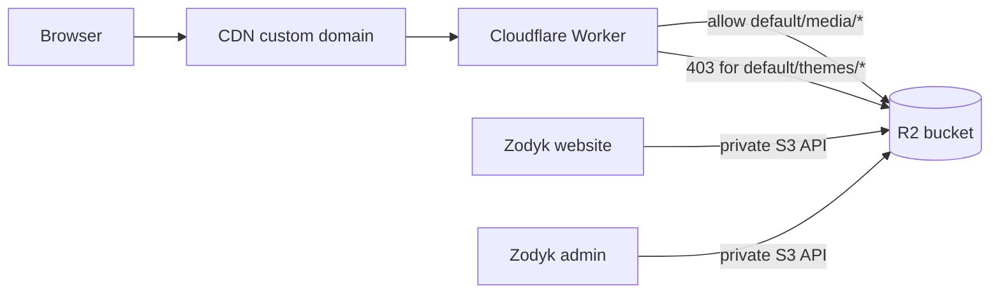

# Secure R2 CDN (same bucket) — step-by-step

This guide locks down **theme source files** in R2 while keeping **media** publicly accessible via your CDN domain (e.g. `https://zodyck-cdn.example.com`).

Zodyk stores objects in one bucket:

| Prefix | Example key | Public via CDN? |
|--------|-------------|-----------------|
| Media | `default/media/{assetId}/photo.jpg` | **Yes** |
| Theme source | `default/themes/{themeId}/sections/hero.liquid` | **No** |
| Theme templates | `default/themes/{themeId}/templates/index.json` | **No** |
| Theme assets | `default/themes/{themeId}/assets/theme.css` | **No** (served by website `/assets/*`) |

---

## How it works



- **Browser → CDN:** Only `default/media/*` is allowed.
- **Website → R2:** Uses API keys server-side for themes (Liquid render + `/assets/*` proxy).
- **Direct R2 public bucket URL:** Disabled so theme paths cannot be fetched without the Worker gate.

---

## Prerequisites

- Cloudflare account with R2 enabled
- An R2 bucket already used by Zodyk (same bucket for themes + media)
- A custom domain on Cloudflare (e.g. `cdn.example.com` or `zodyck-cdn.ogxaryan.com`)
- Zodyk env vars set: `R2_ACCOUNT_ID`, `R2_ACCESS_KEY_ID`, `R2_SECRET_ACCESS_KEY`, `R2_BUCKET`, `R2_PUBLIC_URL`

---

## Step 1 — Remove direct public access on the bucket

If your CDN domain is attached as **R2 public bucket access**, every object key is readable (including full theme source).

1. Open [Cloudflare Dashboard](https://dash.cloudflare.com) → **R2** → your bucket.
2. Go to **Settings**.
3. Under **Public access** / **Custom domains**:
   - **Remove** or **disable** the custom domain that points directly at public bucket access.
4. Confirm that visiting a theme URL directly (without Worker) no longer works, or returns an error:

   ```
   https://YOUR-CDN-DOMAIN/default/themes/{themeId}/assets/theme.css
   ```

   (It may still work until Step 4 — that’s expected while the old public route exists.)

---

## Step 2 — Create a Cloudflare Worker

1. Dashboard → **Workers & Pages** → **Create**.
2. Choose **Create Worker**.
3. Name it e.g. `zodyk-cdn-gate`.
4. Replace the default script with the worker below (Step 3).
5. **Save**.

---

## Step 3 — Worker script (media public, themes blocked)

Bind your R2 bucket to the worker:

1. Worker → **Settings** → **Bindings** → **Add** → **R2 bucket**.
2. Variable name: `ZODYK_BUCKET` (must match the code).
3. Select your Zodyk R2 bucket.

Worker code (also in [`cloudflare-cdn-worker.js`](./cloudflare-cdn-worker.js)):

```js
export default {
  async fetch(request, env) {
    try {
      if (!env.ZODYK_BUCKET) {
        return new Response('R2 binding ZODYK_BUCKET is missing', { status: 500 });
      }

      if (request.method !== 'GET' && request.method !== 'HEAD') {
        return new Response('Method not allowed', { status: 405 });
      }

      const url = new URL(request.url);
      const key = decodeURIComponent(url.pathname.replace(/^\/+/, ''));
      if (!key) {
        return new Response('Not found', { status: 404 });
      }

      const isMedia = key.startsWith('default/media/');
      if (!isMedia) {
        return new Response('Forbidden', { status: 403 });
      }

      const object = await env.ZODYK_BUCKET.get(key);
      if (!object) {
        return new Response('Not found', { status: 404 });
      }

      const headers = new Headers();
      if (object.httpMetadata) {
        object.writeHttpMetadata(headers);
      }
      if (!headers.has('Content-Type')) {
        headers.set('Content-Type', 'application/octet-stream');
      }
      headers.set('Cache-Control', 'public, max-age=31536000, immutable');
      if (object.httpEtag) {
        headers.set('ETag', object.httpEtag);
      }

      if (request.method === 'HEAD') {
        return new Response(null, { status: 200, headers });
      }

      return new Response(object.body, { status: 200, headers });
    } catch (error) {
      const message = error instanceof Error ? error.message : 'Unknown error';
      return new Response(`Worker error: ${message}`, { status: 500 });
    }
  },
};
```

Deploy the worker.

---

## Step 4 — Attach custom domain to the Worker (not the bucket)

1. Worker → **Triggers** → **Custom Domains** → **Add**.
2. Enter your CDN hostname, e.g. `zodyck-cdn.ogxaryan.com`.
3. Cloudflare will create the DNS record (proxied orange cloud).

**Important:** The custom domain must point to the **Worker**, not to R2 public bucket access from Step 1.

---

## Step 5 — Configure Zodyk environment

In Vercel (or `.env` for production):

```env
R2_ACCOUNT_ID=your_account_id
R2_ACCESS_KEY_ID=your_access_key
R2_SECRET_ACCESS_KEY=your_secret_key
R2_BUCKET=your-bucket-name
R2_PUBLIC_URL=https://zodyck-cdn.ogxaryan.com
R2_ENDPOINT=https://<account_id>.r2.cloudflarestorage.com
```

| Variable | Purpose |
|----------|---------|
| `R2_PUBLIC_URL` | Base URL for **media** URLs in admin (`getPublicUrl`) |
| API keys | Server-side read/write for themes + media (never expose to browser) |

Zodyk behavior (no code changes required for basic setup):

- **Media** → public URLs like `https://zodyck-cdn.../default/media/...`
- **Theme CSS/JS** → `https://your-website.com/assets/theme.css` (proxied from R2 with private API)
- **Theme `.liquid` / `.json`** → never exposed in HTML as CDN links

---

## Step 6 — Verify access rules

Run these in an incognito browser or with `curl`.

### Should return 200 (media)

```bash
curl -I "https://zodyck-cdn.ogxaryan.com/default/media/{assetId}/{filename}"
```

### Should return 403 (theme source)

```bash
curl -I "https://zodyck-cdn.ogxaryan.com/default/themes/{themeId}/sections/hero.liquid"
curl -I "https://zodyck-cdn.ogxaryan.com/default/themes/{themeId}/templates/index.json"
curl -I "https://zodyck-cdn.ogxaryan.com/default/themes/{themeId}/config/settings_schema.json"
```

### Should return 403 (theme assets on CDN — if you did not enable `isThemeAsset`)

```bash
curl -I "https://zodyck-cdn.ogxaryan.com/default/themes/{themeId}/assets/theme.css"
```

### Should return 200 (storefront proxy — your website, not CDN)

```bash
curl -I "https://your-website.com/assets/theme.css"
```

---

## Step 7 — Production checklist

- [ ] R2 bucket has **no** direct public custom domain (Worker only)
- [ ] Worker binding `ZODYK_BUCKET` points to correct bucket
- [ ] Worker deployed and custom domain active
- [ ] Theme `.liquid` / `.json` paths return **403** on CDN
- [ ] Media paths return **200** on CDN
- [ ] Storefront loads CSS via `/assets/*` on website domain
- [ ] `R2_SECRET_ACCESS_KEY` only in server env (Vercel), never in client
- [ ] Re-test after any Worker or R2 settings change

---

## Optional — Allow theme `assets/*` on CDN

If you want CSS/JS served from CDN instead of the website proxy:

1. Uncomment `isThemeAsset` in the Worker and add it to the allow condition.
2. Update Liquid `asset_url` in Zodyk to emit CDN URLs for live themes (code change required).

**Recommendation:** Keep theme assets on `/assets/*` for simpler preview/draft handling. Use CDN for **media only**.

---

## Troubleshooting

### `error code: 1101` (HTTP 500)

Cloudflare **1101** means the Worker **threw an uncaught exception** (it crashed before returning a normal response).

**Quick diagnosis:** If theme URLs return **403** but media URLs return **1101**, your Worker script is deployed but the **R2 bucket binding is missing or misnamed**. Theme paths return 403 *before* calling R2; media paths call `env.ZODYK_BUCKET.get()` and crash when the binding is absent.

```bash
# 403 = worker runs, access rule works
curl -I "https://zodyck-cdn.ogxaryan.com/default/themes/test/assets/theme.css"

# 1101 = worker crashes on R2 fetch (binding problem)
curl -I "https://zodyck-cdn.ogxaryan.com/default/media/{assetId}/file.webp"
```

**Fix:**

1. Open Worker → **Settings** → **Bindings**.
2. Click **Add** → **R2 bucket**.
3. Variable name: **`ZODYK_BUCKET`** (exact, case-sensitive — not the bucket name `zodyck`).
4. Bucket: select **`zodyck`** (same as `R2_BUCKET` in `.env`).
5. **Save** and **Deploy** the worker (bindings only apply after redeploy).

Or deploy from this repo (updates script + binding):

```bash
npx wrangler deploy -c infrastructure/deployment/wrangler.cdn-worker.toml
```

After fixing, the same `curl` should return **200** (or **404** if the key is wrong — not 1101).

**Why admin might still show the image:** Your browser may have cached it from before the Worker was attached, or from when R2 had direct public access. Open the CDN URL in a private/incognito window to test.

**Other causes:**

| Symptom | Cause | Fix |
|---------|--------|-----|
| 1101 immediately on any URL | `env.ZODYK_BUCKET` undefined | Add R2 binding `ZODYK_BUCKET`, redeploy |
| 1101 only on some files | Worker bug / `writeHttpMetadata` | Use script from `cloudflare-cdn-worker.js` (has try/catch) |
| Plain `404 Not found` | Object key wrong in URL | Copy exact `r2Key` from MongoDB `MediaAsset` or R2 dashboard |
| `403 Forbidden` | Path not under `default/media/` | Legacy uploads used `default/{assetId}/...` without `media/` — re-upload or allow old prefix in Worker |

**Verify the exact object key:**

1. Admin → Media → inspect asset URL, or check MongoDB `MediaAsset.r2Key`.
2. New uploads use: `default/media/{assetId}/{filename}` (and variants `.webp` / `.avif`).
3. Test with the **full key** from the database:

```bash
curl -I "https://zodyck-cdn.ogxaryan.com/default/media/OBJECT_ID_HERE/filename.webp"
```

**View Worker logs:**

1. Cloudflare Dashboard → Workers → your worker → **Logs** (or **Observability**).
2. Trigger the request again with `curl`.
3. Read the stack trace for the real error.

After fixing bindings, a missing object should return **404**, not 1101.

### Other issues

| Problem | Likely cause | Fix |
|---------|--------------|-----|
| Theme files still public on CDN | Custom domain still on R2 public access | Remove bucket public domain; use Worker domain only |
| Media returns 403 | Key doesn’t start with `default/media/` | Use `r2Key` from DB; re-upload if legacy path |
| Media returns 404 | Wrong key or wrong bucket binding | Match `r2Key` in R2 dashboard |
| Website `/assets/*` broken | Missing R2 API env vars on website app | Set all `R2_*` vars on website Vercel project |
| Admin media upload fails | API keys or bucket name wrong | Test with `/api/v1/storage/health` in admin |

---

## Security notes

- **Safe for production** when Worker rules are correct and bucket is not directly public.
- Rendered HTML is always public; you are protecting **source files**, not page output.
- Theme IDs may leak via preview URLs — that is OK if CDN returns 403 for theme keys.
- Rotate R2 API tokens if they are ever exposed.

---

## Related Zodyk paths

| Area | Location |
|------|----------|
| Media R2 keys | `default/media/{assetId}/{filename}` — `packages/media/src/objects.ts` |
| Theme R2 keys | `default/themes/{themeId}/{path}` — `packages/media/src/objects.ts` |
| Media public URLs | `packages/media/src/urls.ts` → `getPublicUrl()` |
| Theme asset proxy | `apps/website/src/app/assets/[...path]/route.ts` |
| Env template | `.env.example` |
